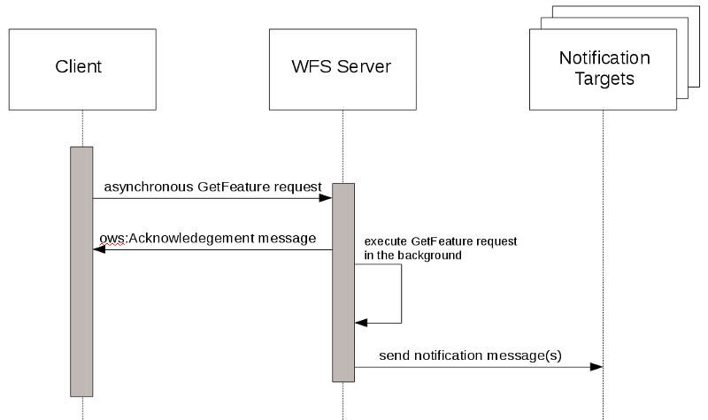
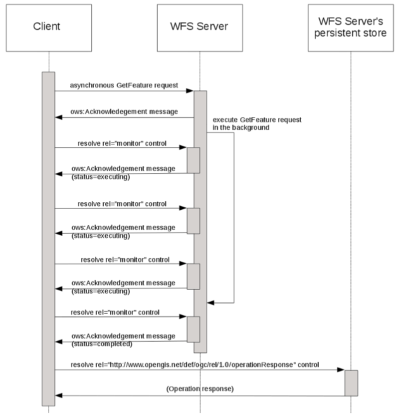

[[simple-async_extension]]
= Simple asynchronous request extension

This proposal describes a light-weight protocol extension for processing
long-running  operations asynchronously.  Rather than the standard
request-response invocation pattern – where a client submits a request
and then waits to get the response from the server – an asynchronous
request is executed in the background by the server and either a
notification message is sent when operation processing has completed
and/or (depending on the conformance classes implemented) the server may
be polled periodically to determine the execution status of the request.

NOTE: In this proposal, http://docs.ogc.org/is/17-069r3/17-069r3.html[OGC API - Features] (OAPIF) is used as an exemplar of a server that can be extended with asynchronous processing capabilities.  However, this extension can be added to any resource endpoint where asynchrous processing make sense.

== Conformance classes

Two conformance classes are defined for asynchronous request processing:

   . Asynchronous Processing
   . Asynchronous Polling

For the Asynchronous Processing conformance class, a server implements the
ability to accept an asynchronous request, acknowledge that the request was
successfully accepted, process the request in the background and finally
send a notification -- using the specified response handler -- when the
request's processing has been completed.  Servers that implement this class
may optionally provide a hypermedia control that may be used to cancel the
asynchronous request after it has been invoked.

For the Asynchronous Polling conformance class, a server implements the
ability to accept an asynchronous request, acknowledge that the request was
successfully accepted, process the request in the background and allow
the server to be polled periodically to obtain the execution status and
progress of the request's execution.  Once request processing has been
completed a hypermedia control, provided by the server, will allow the
request's response to be retrieved.

[[response_handler]]
== responseHandler parameter

Asynchronous request processing shall be triggered by the presence of the
*responseHandler* parameter.

The *responseHandler* parameter may be added to any resource endpoint.  For
example, it may be added to the following OAPIF endpoint to support
asynchronous fetching of features:

* /collections/{collectionId}/items

If the *responseHandler* parameter is present, the server shall immediately
respond with an HTTP `202 Accepted` status code.  The body of the response shall
contain  an <<AcknowledgementEncoding,acknowledgement message>> that indicates
that the request has been successfully accepted.   At this point communication
with the server shall terminate.

NOTE: If there was an exception submitting the request the server shall respond with a HTTP status code in the 4xx or 5xx range.  The response may, depending
on the specific status code, contain an excpetion message in the body.

Once the request has been accepted, the  server shall then proceed to process
the request in the background, taking as much time as necessary to completed
its processing.

For servers that implement the Asynchronous Processing class, when request
processing has completed a notification message shall be sent using the
scheme(s) specified as the value of the *responseHandler* parameter.  The
content of the notification message is discussed in the 
<<NotificationMessage>> section.

For servers that implement the Asynchronous Polling class, the
<<AcknowledgementEncoding,acknowledgement>> message shall contain a means by
which the server may be polled to determine the execution status of the
request.  When request processing has been completed, the acknowledgement
message shall contain a means by which the request's response may be retrieved.

The value of the *responseHandler* parameter shall be a list of one or more
values.  The value of each element of the list shall either be a URI or the
token "poll".

If a list element value of the *responseHandler* parameter is a URI, then its
form shall be  a valid expression of the one the notification schemes that
the server claims to support in its API document.

This standard does not define a normative set of notification schemes but
possible schemes include:

   * Email scheme as per RFC 2368
   ** Example -- mailto:tb12@pvretano.com

   * Sms scheme as per Apple Inc. (or perhaps RFC 5724)
   ** Example – sms:1-555-555-5555

   * Webhook as per http://www.webhooks.org
   ** Example --  http://www.myserver.com/posthandler

The specific set of schemes supported for each operation shall be advertised
in the server's API document.

If a list element value of the *responseHandler* parameter is the token "poll",
the server shall, in its <<AcknowledgementEncoding,acknowledgement message>>,
provide a hypermedia control  that may be used to
<<AsyncPollingSemantics,poll the server periodically>> to determine the
execution status of the request.

If more than one instance of the "poll" token appears as a list element value
of the *responseHandler* parameter, the extraneous instances of the token shall
be ignored.  The <<AsyncPollingSemantics,"poll">> token need only appear once
to trigger the inclusion of the status, progress and control elements within
acknowledgement messages.

The following YAML fragment defines the  *responseHandler* parameter.

[source,yaml]
----
name: responseHandler
in: query
description: A list of response handlers.
required: false
allowEmptyValue: false
schema:
  type: array
  items:
    type: string
    format: url
style: form
explode: false
----

[[example_A]]
.The following example fetches NHD flow lines asynchronously from an OAPIF `items` endpoing:
====
----
https://eratosthenes.pvretano.com/cubewerx/cubeserv/default/ogcapi/framework/collections/NHDFLHI/items?
     count=100&
     f=application%2Fgeo%2Bjson&
     bbox=37.709077,-122.513476,37.839064,-122.351771&
     responseHandler=pvretano@pvretano.com
----
====

NOTE: Examples in this proposal are formatted to facilitate readability and to highlight the various query parameters.

[[AcknowledgementEncoding]]
== Acknowledgement schema

This proposal defines the XML-Schema and JSON-schema of the acknowledgement
message that is  used to signal that an asynchronous request has been
successfully accepted.  The same message schema is also used in response
to a polling request to indicate the execution status of an asynchronous
request.

The following JSON-Schema fragment define the JSON encoding of the
acknowledgement message.

[source,JSON]
----
   "ackMessageType" : {
      "type" : "object",
      "properties" : {
         "links" : {
            "type" : "array",
            "items" : {
               "$ref" : "#/components/schemas/jsonLink"
            }
         },
         "executionStatus": {
            "type": "string",
            "enum": [
               "cancelled",
               "completed",
               "executing",
               "pending"
            ]
         },
         "precentCompleted": {
            "type": "integer"
         }
      }
   },
   "jsonLink" : {
      "type" : "object",
      "required" : [
         "href"
      ],
      "properties" : {
         "href" : {
            "type" : "string",
            "format" : "uri"
         },
         "rel" : {
            "type" : "string",
            "example" : "next"
         },
         "type" : {
            "type" : "string",
            "example" : "application/gml+xml;version=3.2"
         },
         "hreflang" : {
            "type" : "string",
            "example" : "el"
         },
         "title" : {
            "type" : "string",
            "example" : "Trierer Strasse 70, 53115 Bonn"
         }
      }
   }
----

The following XML-Schema fragment defines the ows:Acknowledgement element:

[source,XML]
----
   <xsd:element name="Acknowledegment"
                type="ows:Acknowledgement" id="Acknowledgement"/>
   <xsd:complexType name="Acknowledgement" id="AcknowledgementType">
      <xsd:sequence>
         <xsd:element ref="atom:link" minOccurs="0" maxOccurs="unbounded"/>
         <xsd:element name="Status"
                      type="wfs:ExecutionStatusType" minOccurs="0"/>
         <xsd:element name="PercentCompleted"
                      type="xsd:nonNegativeInteger" minOccurs="0"/>
      </xsd:sequence>
   </xsd:complexType>

   <xsd:simpleType name="ExecutionStatusType">
      <xsd:union>
         <xsd:simpleType>
            <xsd:restriction base="xsd:string">
               <xsd:enumeration value="cancelled"/>
               <xsd:enumeration value="completed"/>
               <xsd:enumeration value="executing"/>
               <xsd:enumeration value="pending"/>
            </xsd:restriction>
         </xsd:simpleType>
         <xsd:simpleType>
            <xsd:restriction base="xsd:string">
               <xsd:pattern value="other:\w{2,}"/>
            </xsd:restriction>
         </xsd:simpleType>
      </xsd:union>
   </xsd:simpleType>
----

When an operation is invoked asynchronously, the server shall respond
immediately with an acknowledgement message indicating that the server
has successfully accepted the request or an OGC exception message indicating
an error.  If successfully accepted, the HTTP status code shall be set to
"202 Accepted".

== Asynchronous Processing class

For servers that implement the Asynchronous Processing conformance class, the
acknowledgement message may contain an link, with rel="cancel",
that may be used to cancel the asynchronously invoked operation.

The response to resolving the rel="cancel" link shall be an acknowledgement
message that shall contains the wfs:Status element with its value set to
"cancelled".  The HTTP status code in this case shall be set to "200 OK".

NOTE: The "cancel" link may also be included in the response's HTTP header
using the Link field (see https://tools.ietf.org/html/rfc5988[RFC 5988]).

NOTE: This document does not define a specific template, form or encoding of
any link that appears in an acknowledgement message.  Server implementations
are free to encode the URI value of the href attribute of a link element
in whatever way they deem suitable.

NOTE: When resolving links, this should be done with the same credentials
as the original asynchronous request.

[[AsyncProcessingClassSeq]]
.Sequence diagram for the Asynchronous Process Class

[[example_B]]
.Simple JSON acknowledgement with a hypermedia control to cancel the request.
====
----
   {
      "links": [
         {"rel": "cancel",
          "href": "http://www.someserver.com/jobs/cancel/1013"}
      ]
   }
----
====

[[AsyncPollingSemantics]]
== Asynchronous Polling class

For servers that implement the Asynchronous Polling conformance class, the
acknowledgement message shall include a link element, with rel="monitor"
that may be periodically resolved to determine the execution status of an
asynchronous request.

The response to resolving the rel="monitor" link shall be an acknowledgement
message that shall contain the a status component indicating the execution
status of the asynchronous request and may include a percent completed
component with a percentage value indicating how much of the request has been
completed.  The HTTP status code in this case shall be set to "200 OK".

Requesting the execution status of an asynchronous request after its processing
has been completed -- and the operation's response is still available -- shall
result in an acknowledgement message that shall contain a status component
with its value set to "completed" and shall also include a link component,
with  rel="http://www.opengis.net/def/rel/ogc/1.0/operationResponse", that
provides a URI that may be used to retrieve the response.

Requesting the execution status of an asynchronous request after its processing
has been completed -- and the operation's response is no longer available (e.g.
is has expired) -- shall result in an OGC exception message and the HTTP status
code shall be set to "404 Not Found".

NOTE: The rel "http://www.opengis.net/def/rel/ogc/1.0/operationResponse" is
an extension relation type (see https://tools.ietf.org/html/rfc5988[RFC 5988], Section 4.2) and shall, in due course,
be defined with OGC Naming Authority.

NOTE: The "http://www.opengis.net/def/rel/ogc/1.0/operationResponse", "monitor"
and  "cancel" links may also be included in the response's HTTP header using the
Link field (see https://tools.ietf.org/html/rfc5988[RFC 5988]).

[[AsyncPollingClassSeq]]
.Sequence diagram for the Asynchronous Polling Class

== Examples

[[example_01]]
.Example 1
====
The following example shows the response that a server that implements the Asynchronous Polling conformance class might initially generate in response to an asynchronously invoked operation.  The acknowledgement message contains hypermedia controls to monitor the execution status of the request and to cancel the request.  The execution status at this time is _pending_ indicating that the request has been queued for execution.

[source,JSON]
----
   {
      "links": [
         {"rel": "monitor",
          "href": "http://www.someserver.com/jobs/1013"},
         {"rel": "cancel",
          "href": "http://www.someserver.com/jobs/cancel/1013"},
      "status": "pending"
   }
----
====

[[example_02]]
.Example 2
====
The following example shows a polling response some time after an operation was invoked asynchronously.  The acknowledgement message contains hypermedia controls to monitor the execution status of the request and to cancel the request.

[source,JSON]
----
   {
      "links": [
         {"rel": "monitor",
          "href": "http://www.someserver.com/jobs/1013"},
         {"rel": "cancel",
          "href": "http://www.someserver.com/jobs/cancel/1013"},
      "status": "executing",
      "percentCompleted": 47
   }
----
====

[[example_03]]
.Example 3
====
This following example shows the polling response after request processing has been completed.  Resolving the hypermedia control with rel="http://www.opengis.net/def/rel/ogc/1.0/operationResponse" will retrieve the request's response if it is still available; if the response is not available (e.g. it has expired from the cache) resolving the control would result in an OGC exception message and a "404 Not Found".

[source,JSON]
----
   {
      "links": [
         {"rel": "http://www.opengis.net/def/rel/ogc/1.0/operationResponse",
          "href": "http://www.someserver.com/jobs/results/1013"}
      ],
      "status": "completed",
   }
----
====

[[NotificationMessage]]
== Notification message content

For servers that implement the Asynchronous Processing conformance class, an
operation's response shall be accessible via the notification message sent by
the server using the specified response handler(s) (see <<response_handler>>) to
signal that request processing has been completed.

In general the content of a notification message shall either be the operation's
complete response, or a reference to it, or an exception message.

The specific content of a notification message is not defined in this
document because it is dependent on the scheme(s) specified
as the value of the *responseHandler* parameter (see <<response_handler>>).
For size-limited schemes, such as sms, a URL reference to the response would
seem to be most appropriate since the entire response content is unlikely to
fit into the message space.  For other schemes, such as webhooks, the content
of the notification message can be the complete response of the operation
(e.g. the response to a GetFeature request).  The following table contains
informative recommendations for the content of notification messages based
on the scheme being used:

[#NotificationContent,reftext='{counter:table-num}']
.Recommended notification content based on scheme
[width="90%",cols="20%,40%,40%", options="header"]
|===
| Notification scheme
| Recommended content (good response)
| Recommended content (exception)
| mailto:
| An email message containing a URL for retrieving the operation's response.
| An email message containing a narrative that describes the exception; an optional attachment with the server's actual OGC exception message may also be included
| sms:
| A URL for retrieving the operation's response; tiny URLs may be used if the retrieval URL is particularly long
| A URL for retrieving the server's OGC exception message; tiny URLs may be used if the retrieval URL is particularly long
|http: (webhook)
| The operation's complete response
| The complete OGC exception message
|===
